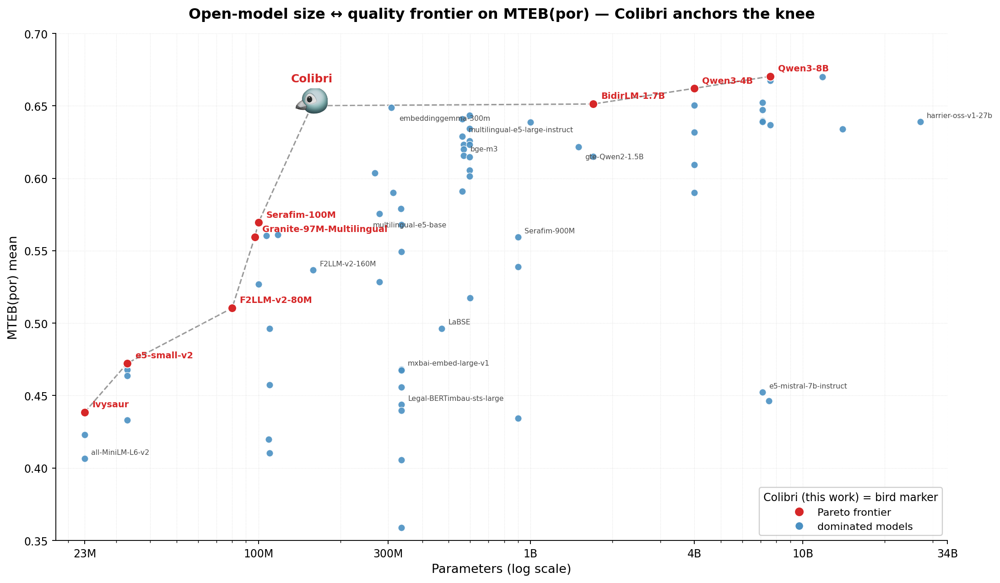

<div align="center">

# 🐦 Colibri — Brazilian-Portuguese Embeddings

**A tiny embedding model that punches far above its weight.**

[](https://huggingface.co/tardellirs/colibri-embed-ptbr)
[-0.6501-1f6feb)](https://huggingface.co/spaces/mteb-pt/leaderboard)
[](#)
[](#)
[](https://ai.google.dev/gemma/terms)
[](LICENSE)

*Named after the **colibri** (hummingbird) — the smallest bird, yet it out-flies much larger ones.*

</div>

---

Colibri is a compact **Brazilian-Portuguese text-embedding model** derived from
[`google/embeddinggemma-300m`](https://huggingface.co/google/embeddinggemma-300m). Despite being **half the size**,
it **matches or beats much larger multilingual embedders on MTEB(por)** — including 7B and 27B models — and is
**designed small on purpose so it runs comfortably on a simple CPU VPS**, with no GPU required.

This repository holds the **training / evaluation pipeline** and the figures. The model itself lives on the Hub:
👉 **[`tardellirs/colibri-embed-ptbr`](https://huggingface.co/tardellirs/colibri-embed-ptbr)**

## ✨ Highlights

- 🏆 **Beats bigger models** on MTEB(por) — including `embeddinggemma-300m`, and 7B / 27B multilingual embedders.
- 🪶 **Half the footprint** of `embeddinggemma-300m`: ~607 MB vs ~1.2 GB, and less RAM.
- 💻 **Runs on a $-few/month CPU VPS** — benchmarked on 4 vCPU / 16 GB (no GPU).
- 🔌 **Plain `SentenceTransformer`** — no adapters, no LoRA at inference. Drop-in.
- 📐 **Matryoshka dimensions** (768 / 512 / 256 / 128) + an **fp16** branch + a **fast ONNX** path.

---

## 🥇 Size ↔ quality frontier

Colibri sits on the **open-model Pareto frontier** for MTEB(por) — it **dominates its own base**
`embeddinggemma-300m` (half the size, higher score) and matches models up to ~10× larger:



| Model | Params | MTEB(por) |
|---|---:|:---:|
| 🐦 **Colibri** | **~157M** | **0.6501** |
| google/embeddinggemma-300m | 300M | 0.6490 |
| Linq-AI-Research/Linq-Embed-Mistral | 7B | 0.6473 |
| openai/text-embedding-3-large | – | 0.6449 |
| intfloat/multilingual-e5-large-instruct | 560M | 0.6409 |
| Salesforce/SFR-Embedding-2_R | 7B | 0.6397 |
| Alibaba-NLP/gte-Qwen2-7B-instruct | 7B | 0.6392 |
| microsoft/harrier-oss-v1-27b | 27B | 0.6390 |
| BAAI/bge-m3 | 568M | 0.6157 |

> Evaluated on **[MTEB(por)](https://huggingface.co/spaces/mteb-pt/leaderboard)** — 22 native Brazilian-Portuguese tasks
> (retrieval, reranking, STS, classification, clustering, pair-classification). Score = mean over the 22 tasks.

---

## 🚀 Usage

```python
from sentence_transformers import SentenceTransformer

model = SentenceTransformer("tardellirs/colibri-embed-ptbr")

query = "Como declarar imposto de renda de aluguel?"
docs = [
    "Rendimentos de aluguel devem ser informados na ficha de Rendimentos Tributáveis...",
    "O Pix é um meio de pagamento instantâneo criado pelo Banco Central...",
]

q = model.encode(query, prompt_name="query")      # "task: search result | query: "
d = model.encode(docs, prompt_name="document")    # "title: none | text: "
print(model.similarity(q, d))
```

**Faster on CPU — ONNX backend** (≈2× throughput, no pipeline changes):

```python
model = SentenceTransformer("tardellirs/colibri-embed-ptbr", backend="onnx")
```

**Smaller vectors — Matryoshka** (truncate to 512 / 256 / 128):

```python
model = SentenceTransformer("tardellirs/colibri-embed-ptbr", truncate_dim=256)
```

---

## 💻 Built for a simple CPU VPS

Benchmarked head-to-head against `google/embeddinggemma-300m` on a **4 vCPU / 16 GB** VPS:

| Precision | Model | Model size | Peak RAM | Latency (p50) | Throughput |
|---|---|---:|---:|---:|---:|
| **fp32** | 🐦 **Colibri** | **607 MB** | **969 MB** | 76 ms | 37 sent/s |
| fp32 | embeddinggemma-300m | 1211 MB | 1253 MB | 78 ms | 36 sent/s |
| **ONNX** | 🐦 **Colibri** | ~600 MB | 2.9 GB | **33 ms** | **49 sent/s** |
| ONNX | embeddinggemma-300m | ~1200 MB | 5.3 GB | 38 ms | 41 sent/s |

Half the size and less RAM, same encode latency (the vocabulary trim shrinks the token-embedding matrix, not the
transformer compute) — you lose nothing in speed. See [`scripts/cpu_bench.py`](scripts/cpu_bench.py).

---

## 🔧 How it was built

A three-stage pipeline: **vocabulary trimming → multi-teacher distillation → model soup**.

**1. Vocabulary trimming** — [`scripts/retrim_vocab.py`](scripts/retrim_vocab.py)
Trims `embeddinggemma-300m`'s 262k multilingual vocabulary down to a **~64k Brazilian-Portuguese vocabulary**,
cutting the model from ~300M to **~157M effective parameters** with negligible quality loss. Base trimmer:
[github.com/tardellirs/embedding-vocab-trimmer](https://github.com/tardellirs/embedding-vocab-trimmer).

**2. Multi-teacher distillation** — [`scripts/distill_precompute.py`](scripts/distill_precompute.py) · [`scripts/distill_train.py`](scripts/distill_train.py)
Relational (similarity-preserving) knowledge distillation from **two complementary teachers** —
[`Qwen3-Embedding-4B`](https://huggingface.co/Qwen/Qwen3-Embedding-4B) (clustering) and
[`Qwen3-Embedding-8B`](https://huggingface.co/Qwen/Qwen3-Embedding-8B) (retrieval / reranking). The student learns
to reproduce the **average of the two teachers' pairwise-similarity matrices** (dimension-agnostic; preserves STS),
on a ~100k-passage native Brazilian-Portuguese corpus ([`scripts/build_distill_v2_corpus.py`](scripts/build_distill_v2_corpus.py)).

**3. Model soup + merge** — [`scripts/soup_eval.py`](scripts/soup_eval.py) · [`scripts/extend_sweep.py`](scripts/extend_sweep.py)
Distillation checkpoints are combined (model soup) and linearly merged with the trimmed base
(θ = 0.35·base + 0.65·soup), with the mixing weight chosen on held-out validation. Everything yields ordinary
weights, so the published model is a single standalone encoder.

> **Evaluation integrity:** trained only on training / non-evaluation splits — every MTEB(por) evaluation example
> is held out, so the scores reflect generalization, not memorization.

Full run log & numbers: [`RESULTS.md`](RESULTS.md). Orchestrator: [`scripts/run_distill_v2.sh`](scripts/run_distill_v2.sh).

---

## 📁 Repository layout

```
scripts/
  # 1 · vocabulary trimming
  build_retrim_corpus.py      #    token-selection corpus (domains + Stack Overflow PT)
  get_stackoverflow_pt.py     #    Stack Overflow em Português source
  retrim_vocab.py             #    domain-aware 64k re-trim (300M → ~157M)
  compare_trims.py            #    pick the best trim base on MTEB(por)
  # 2 · multi-teacher distillation
  build_distill_v2_corpus.py  #    assemble the ~100k PT-BR corpus (eval rows held out)
  distill_precompute.py       #    precompute teacher (Qwen3-4B + 8B) embeddings
  distill_train.py            #    multi-teacher relational KD (avg of two sim-matrices)
  select_best.py              #    checkpoint selection by FaqBacen proxy
  # 3 · model soup + merge
  soup_eval.py                #    checkpoint soup + alpha merge
  extend_sweep.py             #    fine alpha sweep (cheap mean_21 → mean_22 on the peak)
  interpolate_eval.py         #    base↔ft weight interpolation + MTEB harness
  # evaluation · benchmark · figure
  run_mtebpt.py               #    official MTEB(por) 22-task evaluation
  cpu_bench.py                #    CPU latency / RAM benchmark
  variant_quality.py          #    Matryoshka dims + fp16 quality
  make_colibri_pareto.py      #    the frontier figure above
  run_distill_v2.sh           #    end-to-end orchestrator
  run_compare.sh · run_cpu_bench.sh · run_bench.sh · run_quality.sh
docs/teacher_survey.md        # why Qwen3-4B + 8B (multi-teacher rationale)
figures/pareto.png
RESULTS.md                    # full run log & per-task numbers
```

---

## 📜 License

- **Code** in this repository: [Apache-2.0](LICENSE).
- **Model weights** (`tardellirs/colibri-embed-ptbr`): [Gemma Terms of Use](https://ai.google.dev/gemma/terms),
  inherited from `google/embeddinggemma-300m`.

## 🙏 Acknowledgments

We gratefully acknowledge **[Verda](https://verda.com/?utm_content=mteb-pt)** for the GPU compute credits that
supported this work, and the **[MTEB(por)](https://huggingface.co/spaces/mteb-pt/leaderboard)** benchmark maintainers.

<div align="center">
Built with vocabulary trimming · multi-teacher relational knowledge distillation · model soup. 🐦
</div>
